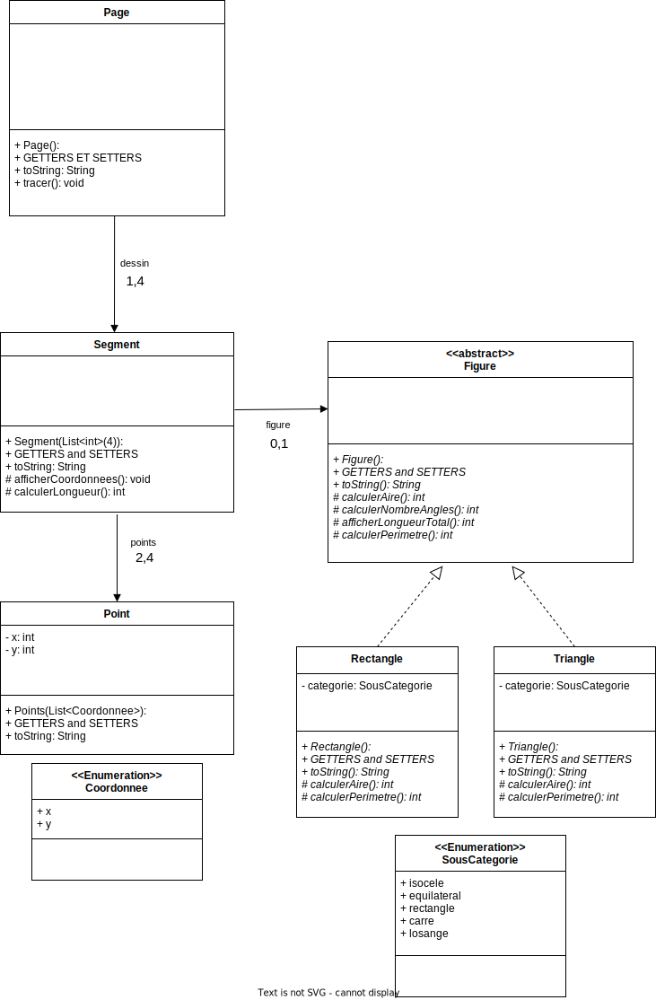

# EXERCICE 1 - Géométrie

**Principe de base :**

Dans cet exercice, nous souhaitons coder des figures géométriques, pour cela l'utilisateur va saisir un nombre de points compris entre 2 et 4.

Chaque point possédera deux coordonnées x et y.

Si uniquement 2 points sont saisis, notre figure sera un segment.

Si l'utilisateur saisit 3 points, notre figure sera un Triangle, soit : 
* quelconque
* isocèle
* équilatéral
* rectangle

Si 4 points sont saisis, ce sera soit un Carré, un Rectangle ou un Losange.

Chaque figure pourra afficher son nombre de côtés, la longueur de chacun d'eux, le nombre d'angles et le degré de ceux-ci, calculer son périmètre et son aire.

**Question :**

1 Représenter le problème suivant sous forme de diagramme de classe

2 Implémenter la classe Segment, cette classe possédera un constructeur, des getters et setters ainsi qu'une méthode permettant d'afficher les coordonnées des 2 points du segment et la distance entre ces points.

3 Implémenter la classe abstraite Figure possèdent une liste de segments, et ayant pour méthode :

* Une méthode abstraite permettant de calculer l'aire de chaque figure
* Une méthode abstraite permettant de calculer le nombre d'angles
* Une méthode pouvant afficher la longueur de chacun des segments
* Une méthode permettant de calculer le périmètre total d'une figure

4 Implémenter les classes Triangle et Rectangle héritant de Figure, coder les méthodes abstraites de celles-ci et redéfinir les méthodes nécessaires.

5 Utiliser une surcharge de constructeurs afin de permettre à l'utilisateur de choisir entre un carré, un rectangle, un losange ou entre les différents triangles.

6 Bonus (Pour les maîtres du Java) Coder un générateur de figure qui, en fonction du nombre de côtés souhaité, du nombre d'angles droits et du nombre de côtés égaux, construit la figure la plus adéquate.
